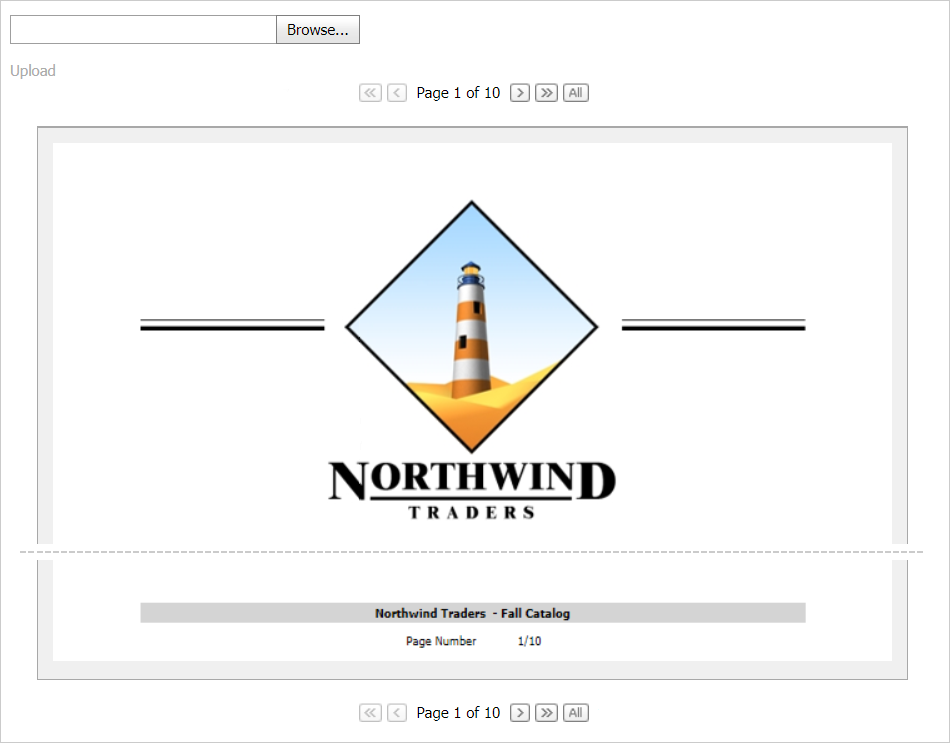

<!-- default badges list -->

<!-- default badges end -->
# PDF Document API for ASP.NET MVC - How to implement a PDF viewer

This example demonstrates how to use the [Office File API](https://docs.devexpress.com/OfficeFileAPI/14911/office-file-api) and [ASP.NET MVC Extensions](https://docs.devexpress.com/AspNetMvc/7896/aspnet-mvc-extensions) to implement a custom PDF viewer. This PDF viewer displays a PDF document's content and allows users to navigate through document pages.

## Overview

Use the following classes to implement the PDF viewer:

* [PdfDocumentProcessor](https://docs.devexpress.com/OfficeFileAPI/DevExpress.Pdf.PdfDocumentProcessor)  
Allows you to manage PDF files. The **PdfDocumentProcessor**'s [LoadDocument](https://docs.devexpress.com/OfficeFileAPI/DevExpress.Pdf.PdfDocumentProcessor.LoadDocument(System.IO.Stream)) method opens a PDF document and the [CreateBitmap](https://docs.devexpress.com/OfficeFileAPI/DevExpress.Pdf.PdfDocumentProcessor.CreateBitmap(System.Int32-System.Int32)) method converts the document's pages to images.

* [BinaryImageEditExtension](https://docs.devexpress.com/AspNetMvc/8978/components/data-editors-extensions/binaryimage)  
Displays a PDF document's pages as images.

* [DataViewExtension](https://docs.devexpress.com/AspNetMvc/13755/components/data-and-image-navigation/dataview)  
Allows users to navigate through pages.

* [UploadControlExtension](https://docs.devexpress.com/AspNetMvc/8977/components/file-management/file-upload)  
Allows users to upload a PDF document to the server.

* [CallbackPanelExtension](https://docs.devexpress.com/AspNetMvc/8975/components/multi-use-site-extensions/callbackpanel)  
Opens a document in the PDF viewer after a user uploads the PDF document to the server.

<!-- default file list -->
## Files to Look At

* [HomeController.cs](./CS/E5101/Controllers/HomeController.cs) (VB: [HomeController.vb](./VB/E5101/Controllers/HomeController.vb))
* **[PdfViewerController.cs](./CS/E5101/Controllers/PdfViewerController.cs) (VB: [PdfViewerController.vb](./VB/E5101/Controllers/PdfViewerController.vb))**
* [PdfPageModel.cs](./CS/E5101/Models/PdfPageModel.cs) (VB: [PdfPageModel.vb](./VB/E5101/Models/PdfPageModel.vb))
* [_CallbackPanelPartial.cshtml](./CS/E5101/Views/Home/_CallbackPanelPartial.cshtml)
* [Index.cshtml](./CS/E5101/Views/Home/Index.cshtml)
* [_DocumentViewPartial.cshtml](./CS/E5101/Views/PdfViewer/_DocumentViewPartial.cshtml)
* [_PdfViewerPartial.cshtml](./CS/E5101/Views/PdfViewer/_PdfViewerPartial.cshtml)
<!-- default file list end -->

## Documentation

- [PDF Document API](https://docs.devexpress.com/OfficeFileAPI/16491/pdf-document-api)
- [How to Export a PDF Document to a Bitmap](https://docs.devexpress.com/OfficeFileAPI/120344/pdf-document-api/examples/export-a-pdf-document-to-an-image/how-to-export-a-pdf-document-to-a-bitmap)

## More Examples

- [PDF Document API for ASP.NET Web Forms - How to implement a PDF viewer](https://supportcenter.devexpress.com/ticket/details/e5095/pdf-document-api-for-asp-net-web-forms-how-to-implement-a-pdf-viewer)